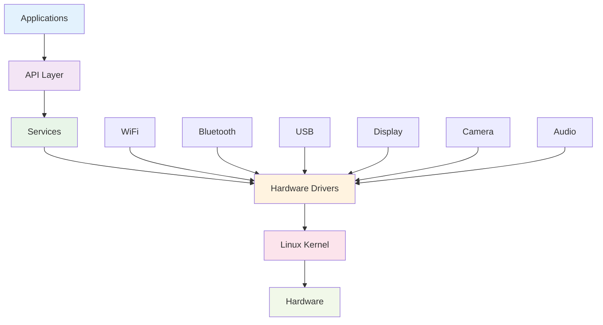

# 🥽 AI Smart Glasses

**An open-source Linux-based smart glasses platform for medical, industrial, educational, and consumer applications**

[](https://github.com/Iam5stillLearning/OpenSource-Ai-Glasses/actions)
[](LICENSE)
[](https://github.com/Iam5stillLearning/OpenSource-Ai-Glasses/releases)
[](README.zh.md)

[Documentation](docs/README.md) • [Quick Start](docs/tutorials/beginner/getting-started.md) • [API Reference](docs/firmware/api-reference.md) • [Community](docs/community/contributing.md)

---

## 📋 Project Overview

This is a Linux-based open-source smart glasses project in early development stage (5% documentation completeness).

**Contact**: iam5stilllearning@foxmail.com

**Language**: [中文版本](README.zh.md) | English Version

## ✨ Key Features

- 🖥️ **Display**: 30°FOV 640×480 monocular display (optional)
- 📸 **Camera**: 4K photo capture, 1080P video recording
- 🔊 **Audio**: Dual microphones + speaker system
- 📡 **Connectivity**: WiFi, Bluetooth 5.0, USB 2.0
- ⚡ **Performance**: Single Cortex-A7 core, 32GB storage
- 🔋 **Battery Life**: 3hr music, 4hr display, 45min recording
- ⚖️ **Lightweight**: Only 43g
- 🧠 **Sensors**: Optional geomagnetic sensor, IMU
- 🐧 **OS**: Full Linux-based system

## 🚀 Quick Start

### Prerequisites

- Linux development environment (Ubuntu 20.04+ recommended)
- Git and basic development tools
- USB-C cable for device connection

### Installation

```bash
# Clone the repository
git clone https://github.com/Iam5stillLearning/OpenSource-Ai-Glasses.git
cd OpenSource-Ai-Glasses

# Setup development environment
./scripts/setup-dev.sh

# Flash firmware
./scripts/flash-firmware.sh

# Verify installation
./scripts/verify-installation.sh
```

### Hello World

```bash
# Connect to device via ADB
adb connect [device-ip]

# Run Hello World application
adb shell /opt/apps/hello-world

# Expected output: "Hello AI Glasses!"
```

## 📊 Hardware Specifications

| Component | Specification |
|-----------|---------------|
| **Processor** | Single Cortex-A7 core |
| **Memory** | 32GB storage (configurable) |
| **Display** | 30°FOV 640×480 monocular (optional) |
| **Camera** | 4K photo, 1080P video |
| **Audio** | Dual microphones + speaker |
| **Connectivity** | WiFi, Bluetooth 5.0, USB 2.0 |
| **Battery** | 180mAh |
| **Weight** | 43g |
| **Battery Life** | 3hr music, 4hr display, 45min recording |

## 🎯 Use Cases

### 🏥 Medical Applications

<details>
<summary>Medical AI Smart Glasses Scenarios</summary>

#### Patient Information Display
Doctors or nurses can instantly see patient name, bed number, main diagnosis, allergy history, and key vital signs in the corner of their vision upon entering patient wards, eliminating the need to repeatedly check medical records or computers.

#### Real-time Vital Signs Monitoring
The glasses can read and integrate data from bedside monitors and infusion pumps in real-time. If patient heart rate, blood oxygen, blood pressure and other indicators show abnormal fluctuations, the system will immediately highlight warnings in the field of view and emit gentle but clear alert sounds through bone conduction headphones.

#### Auxiliary Operation and Procedure Verification
When performing infusion, medication administration and other operations, the glasses' camera automatically scans drug barcodes and patient wristbands to verify "three checks and seven matches" information. If drug dosage errors, patient mismatches or allergy risks are found, warnings will immediately appear in a prominent way to prevent medical errors.

#### Contact-free Information Access
Doctors can use voice commands or gestures to virtually call up patient electronic medical records, imaging reports (such as CT/MRI), and convert spoken ward rounds into text and store them in the system during ward rounds or operations, achieving "what you see is what you record," greatly freeing up hands.

#### Remote Expert Collaboration
In complex consultations or emergency rescues, junior doctors can share real-time first-person video with remote experts. Experts can annotate, circle key points, and provide guidance via voice communication on shared video streams, as if experts were present on site, improving grassroots medical capabilities.

</details>

### 🏭 Industrial Applications

<details>
<summary>Substation Application Scenarios</summary>

#### Read Operation Tickets
Regardless of paper or electronic operation tickets, the glasses can scan and automatically extract key information (such as which equipment to operate, whether to close or open), eliminating the need for manual input and verification character by character.

#### Recognize On-site Equipment
Wearing glasses while walking in the substation, it acts like an experienced inspector, able to recognize in real-time through cameras and AI whether the current equipment is a circuit breaker, disconnector, or grounding switch.

#### Safety Rules
The system has built-in all power safety procedures and "five prevention" logic. It can compare the identified operation commands with the actual equipment status currently seen to determine if the next operation will cause problems.

#### Timely Voice Warnings
Once it finds that I might go to the wrong interval or operate the wrong equipment, it will immediately warn with voice, such as "Error! This is switch 102, please verify!", preventing mistakes. The entire process must be real-time without delay.

#### Independent On-site Work
All calculations and judgments support local deployment, ensuring functionality even in network-unstable emergency or ICU areas.

</details>

<details>
<summary>Maintenance Scenarios</summary>

#### Real-time Video Calls and Screen Sharing
On-site maintenance personnel can share first-person real-time video of faulty equipment with backend expert teams through the glasses camera. Experts can see the situation as clearly as if they were present on site, precisely understanding the on-site conditions while freeing hands during maintenance.

#### AR Annotation and Real-time Guidance
Experts can perform AR annotations (such as drawing circles, arrow indicators, text annotations) on shared video streams, directly "projecting" them into the field personnel's vision, precisely guiding them to "tighten this screw," "measure voltage at that point," greatly improving communication efficiency.

#### Multi-party Consultation and Knowledge Accumulation
Support multiple experts to simultaneously join one video session for "multi-party consultation," quickly solving complex problems. The entire guidance process can be recorded and archived to form maintenance case libraries for specific faults, used for subsequent training.

#### File and Drawing Instant Access
On-site personnel can request experts to remotely push drawings, manuals, or 3D model files through voice commands. Experts can directly send materials and display them on one side of the maintenance personnel's glasses field of view for reference while working.

</details>

### 🎓 Educational Applications

<details>
<summary>AR Intelligent Operation Guidance</summary>

#### Visualized Operation Lists
Break down complex SOPs (Standard Operating Procedures) into step-by-step AR instructions, directly superimposed and displayed on real equipment in the operator's field of vision. The current operation step to be performed will be highlighted, automatically entering the next step upon completion.

#### Tool and Material Recognition
The glasses can recognize whether the operator picked up is the tool or material specified for the current step. If the wrong one is picked up, it will immediately issue a warning to prevent equipment damage or assembly problems caused by using the wrong tool.

#### Automatic Step Confirmation and Recording
The system automatically determines whether a step is completed through visual recognition (such as "screw tightened," "cable properly connected") and automatically records completion time and operator information, achieving paperless and error-proof process confirmation.

#### Voice Navigation When Hands Are Busy
When operators have both hands occupied, they can control the guidance process playback through voice commands like "next," "previous," "repeat," completely freeing hands to focus on the operation itself.

#### New Employee Training and Skill Transfer
New employees can quickly get started with AR guidance, reducing training costs and error rates. Best practices and operating techniques of experienced workers can also be solidified through AR processes for efficient knowledge transfer and standardized operations.

</details>

## 🏗️ System Architecture



## 📚 Documentation

- [📖 Complete Documentation](docs/README.md)
- [🚀 Getting Started Guide](docs/tutorials/beginner/getting-started.md)
- [🔧 Hardware Specifications](docs/hardware/specifications.md)
- [💻 Firmware Development](docs/firmware/getting-started.md)
- [📱 Application Development](docs/software/app-development.md)
- [🔍 Troubleshooting](docs/troubleshooting/common-issues.md)

## 🛠️ Development

### Build from Source

```bash
# Install dependencies
sudo apt-get update
sudo apt-get install build-essential git cmake

# Clone and build
git clone https://github.com/Iam5stillLearning/OpenSource-Ai-Glasses.git
cd OpenSource-Ai-Glasses
mkdir build && cd build
cmake ..
make -j4

# Flash to device
sudo make flash
```

### Development Tools

- **IDE**: VS Code with C/C++ extension
- **Debugger**: GDB + OpenOCD
- **Profiler**: perf, valgrind
- **Version Control**: Git

### API Overview

```c
#include "ai_glasses_api.h"

// Initialize device
int device_init(device_config_t *config);

// Capture photo
int capture_photo(const char *filename);

// Display text
int display_text(const char *text, int x, int y);

// Play audio
int play_audio(const char *filename);

// Get sensor data
int get_sensor_data(sensor_data_t *data);
```

## 🤝 Contributing

We welcome contributions! Please see our [Contributing Guide](docs/community/contributing.md) for details.

### How to Contribute

1. 🍴 Fork the repository
2. 🌿 Create a feature branch (`git checkout -b feature/AmazingFeature`)
3. 💻 Commit your changes (`git commit -m 'Add some AmazingFeature'`)
4. 📤 Push to the branch (`git push origin feature/AmazingFeature`)
5. 🔃 Create a Pull Request

### Development Areas

- 🐛 **Bug Fixes**: Report and fix issues
- ✨ **New Features**: Propose and implement new capabilities
- 📚 **Documentation**: Improve guides and API docs
- 🧪 **Testing**: Add tests and improve coverage
- 🌐 **Internationalization**: Add language support

## 📄 License

This project is licensed under the Apache License 2.0 - see the [LICENSE](LICENSE) file for details.

## 🙏 Acknowledgments

- [Linux Foundation](https://www.linuxfoundation.org/) for Linux OS support
- [OpenCV](https://opencv.org/) for computer vision capabilities
- [BlueZ](https://www.bluez.org/) for Bluetooth protocol stack
- Community contributors and testers

## 📞 Contact

- **Project Maintainer**: [Iam5stilllearning](mailto:iam5stilllearning@foxmail.com)
- **Issues & Bugs**: [GitHub Issues](https://github.com/Iam5stillLearning/OpenSource-Ai-Glasses/issues)
- **Discussions**: [GitHub Discussions](https://github.com/Iam5stillLearning/OpenSource-Ai-Glasses/discussions)
- **Documentation**: [Project Documentation](docs/README.md)

## 🌟 Star History

[](https://star-history.com/#Iam5stillLearning/OpenSource-Ai-Glasses&Date)

---

<div align="center">

**⭐ If this project helped you, please give it a star!**

Made with ❤️ by the open-source community

</div>

---

**Note**: This project is in early development stage (5% documentation completeness). We're actively seeking contributors and feedback!

**Last Updated**: 2025-10-27 | **Version**: v1.0.0